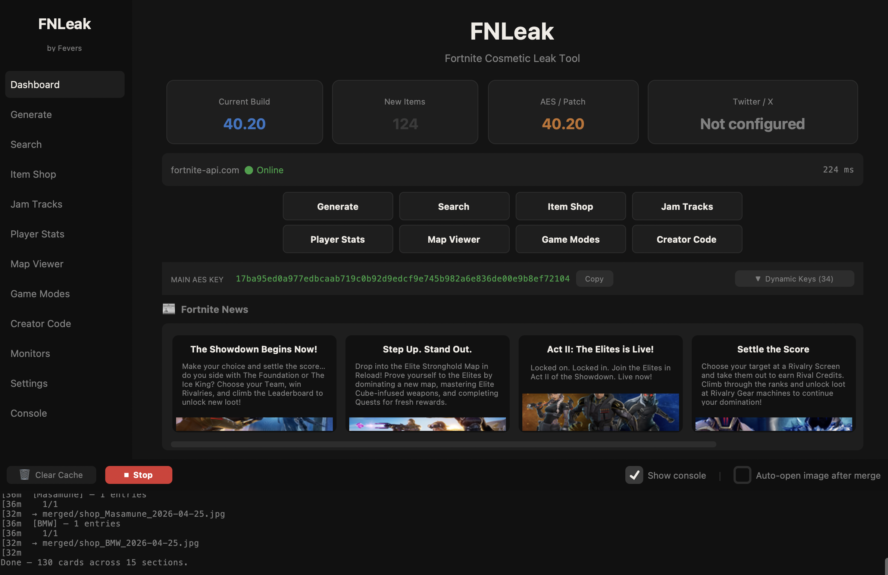
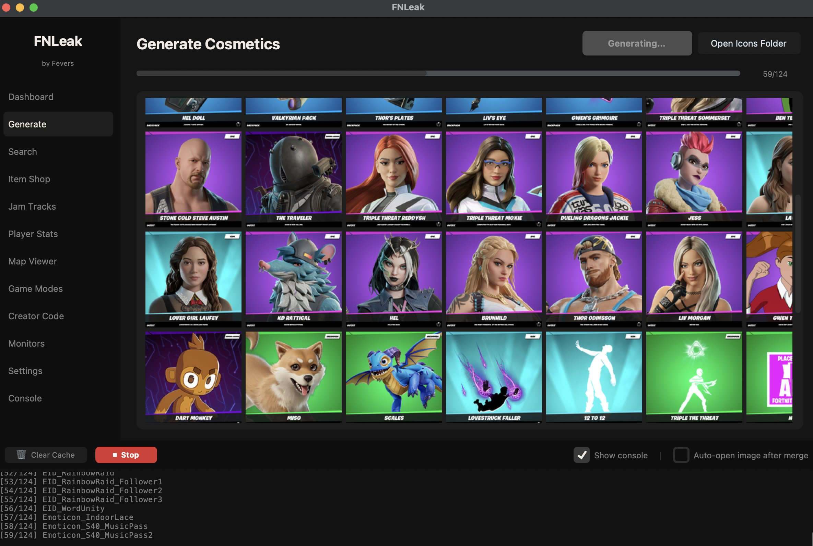
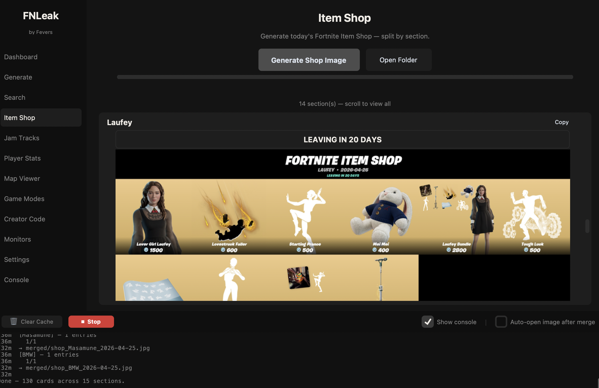
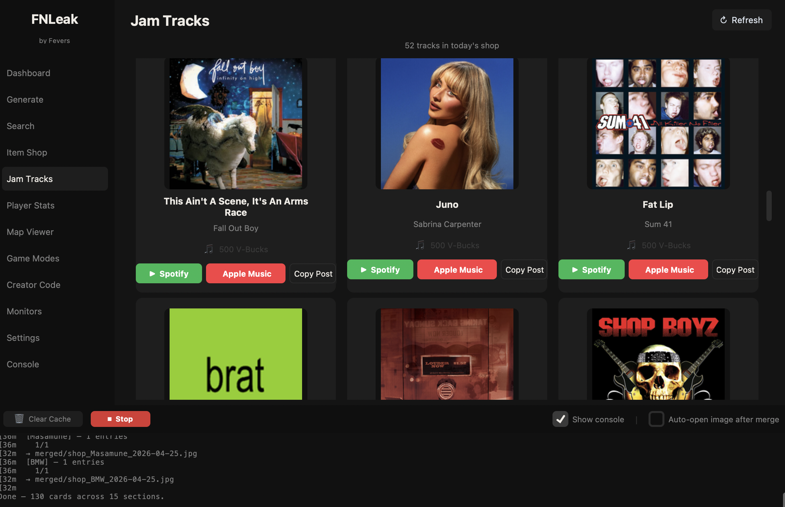
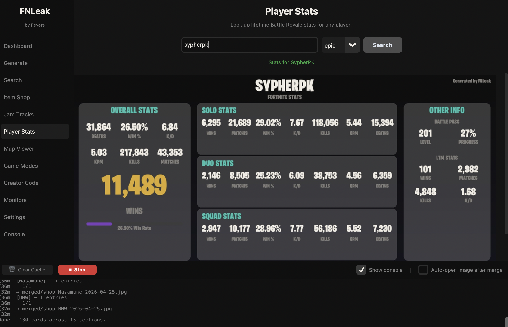
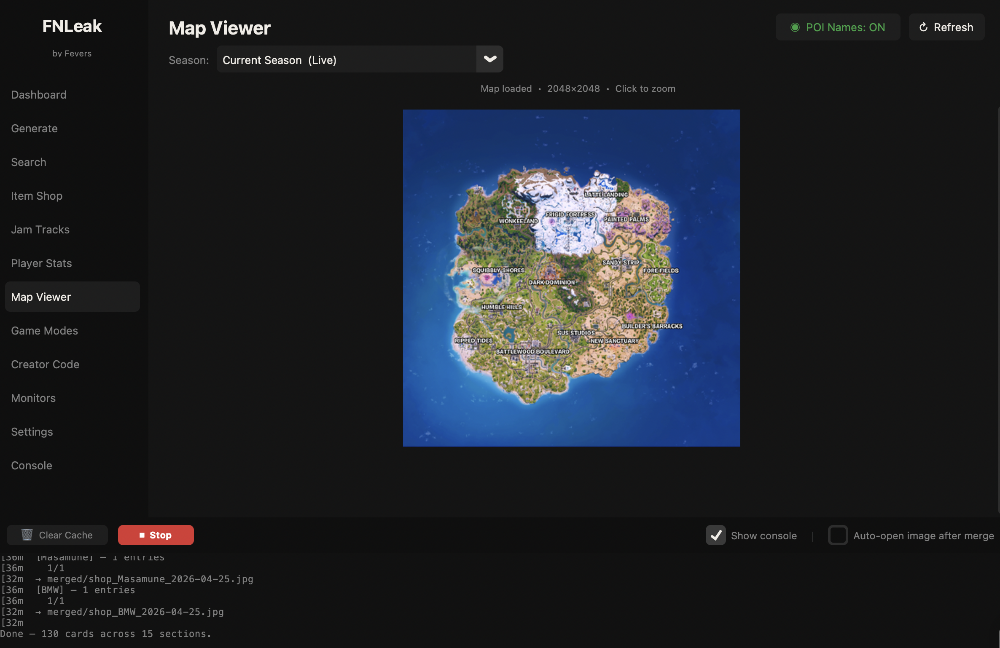

# FNLeak - Created by Fevers

> **Open-source. Locally run. Built for the community.**



---

## The Story

With the reveal of my journey into a creative in the Fortnite community, the past few weeks I've felt the same emotions when I was making it.

I was inspired to create something new — but this time, with the tools I didn't have back then. I focused on how and when to use AI.

**FNLeak** is my new, improved version of **[AutoLeak](https://github.com/FortniteFevers/AutoLeak)**. Simply put, FNLeak is one of a kind: an open-source, locally run program on both macOS and Windows that interacts with multiple Fortnite APIs to bring Fortnite content creation to anyone, regardless of their experience in the field.

Man, I wish I had this program years ago. I created it for me. That small kid with a dream.

---

## What is FNLeak?

FNLeak is a full-featured Fortnite datamining and content creation tool with a polished desktop GUI. Everything runs **locally on your machine** — no cloud subscription, no account required, no data sent anywhere except to the public Fortnite APIs it uses. Generate cosmetic cards, browse the Item Shop, look up player stats, view historical maps, and more — all from one app.

---

## What's New vs AutoLeak

| Area | AutoLeak (original) | FNLeak |
|---|---|---|
| Interface | Terminal menu only | Full dark-theme GUI |
| Platform | Windows-focused | macOS + Windows |
| Distribution | Run from source only | Standalone `.app` / `.exe` |
| Pillow support | Broke on Pillow 10+ | Pillow 10/11 fully compatible |
| Twitter/X | Tweepy v1 `update_with_media` (deprecated) | Tweepy v4, v2 API |
| Item Shop | Basic grid image | Section-by-section with NEW/LEAVING dates, V-Bucks icons |
| Jam Tracks | Not supported | Full Jam Tracks browser with Spotify + Apple Music links |
| Player Stats | Not supported | Full stats card image generation |
| Map Viewer | Not supported | Current + all historical season maps with zoom/pan |
| Game Modes | Not supported | Full playlist browser with thumbnails |
| Outdated API's | Fortntieapi.io, BenBot, no longer supported. | Removed — `fortnite-api.com` only |
| Monitors | Stack overflow risk (recursive retries) | Stable background threads |
| Code size | ~3,100 lines, heavily duplicated | Fully modular |

---

## Features

### Cosmetic Generator
Detect a new Fortnite update and auto-generate styled card images for every new cosmetic. Supports five card styles:
- **New** — Large centred name and description (default)
- **Cataba** — Fortnite-style layered composite with backend type badge
- **Standard** — Centred name, description, and item ID
- **Clean** — Left-aligned minimal style
- **Large** — Featured image layout


### Cosmetic Search
Search any cosmetic by name or ID. Click the thumbnail to open a fullscreen preview. Generate and save the card in any style.

### Item Shop Generator
Generate a full section-by-section image of the current Item Shop with:
- **Section headers** showing whether a set is **NEW** or **LEAVING** (with exact date/time popup on click)
- **V-Bucks icon** on every item price
- **Real-time progress bar** with estimated time remaining during generation
- **Copy button** per section — one click to copy that section's image


### Jam Tracks
Browse all Jam Tracks currently in the shop with album art, artist info, and V-Buck price. Each track has:
- **Spotify** and **Apple Music** direct links
- **Copy Post** button — opens a popup with pre-formatted social media text and buttons to copy the text or album art image separately


### Player Stats
Look up any Fortnite player's lifetime stats by Epic username. Generates a full styled stats card image (1500×680) showing:
- Overall stats: K/D, Win Rate, Kills, KPM, Deaths, Matches, Wins
- Solo / Duo / Squad breakdowns
- Battle Pass level and progress
- LTM stats
- Burbank font rendering with a win-rate progress bar

Buttons: **Open Image**, **Copy Image**, **Tweet Stats**


### Map Viewer
View the current season's live map or any historical season map (Chapter 1 Season 1 all the way through Chapter 7 Season 2, including Mini Seasons). Click the map to open a zoom window with:
- **+ / −** zoom buttons
- **◀ ▲ ▼ ▶** pan controls
- **Fit** button to reset the view
- Scroll wheel and drag support


### Game Modes
Browse all current Fortnite playlists with thumbnails and descriptions.

### Creator Code
Look up any Support-a-Creator code and view earnings stats.

### Monitors
Set up background watchers that auto-run and optionally tweet when triggered:
- **Update** — Detects a new Fortnite patch
- **BR News** — Monitors the Battle Royale news feed
- **Notices** — Monitors Fortnite emergency notices
- **Staging** — Detects Epic's pre-release version bumps
- **Shop Sections** — Monitors Item Shop section layout changes

### Twitter / X Integration
Connect your Twitter/X developer account and tweet generated images directly from the app. Supports tweeting cosmetic cards, merged grids, shop sections, and player stats.

### Settings
Configure everything from the GUI — name, language, card style, fonts, Twitter keys, merge options, and more.

### Console
Live log output from all background operations.

---

## Installation

### macOS — Standalone App (Recommended)

1. Download **`FNLeak-v1.0.0-macOS.zip`** from the [Releases](../../releases) page
2. Unzip and drag **`FNLeak.app`** anywhere — Desktop, Applications folder, Downloads — it doesn't matter
3. **First launch only:** macOS will block the app because it isn't from the App Store. To open it:
   - Right-click `FNLeak.app` → click **Open** → click **Open** in the dialog
   - You only need to do this once
4. The app sets itself up automatically on first launch — no extra folders or files needed

> **Where does FNLeak store its data?**
> All generated images, cache, and your settings live in `~/Library/Application Support/FNLeak/`.
> The app creates this automatically. You never need to touch it.

## Running FNLeak from Source (macOS)

### First-time setup (do this once)

1. Open **Terminal**
2. Run this command to make the launcher executable:

```bash
chmod +x /path/to/FNLeak/run.command
```

> Replace `/path/to/FNLeak/` with the actual folder location, e.g.  
> `chmod +x ~/Desktop/FNLeak/run.command`

---

### Launching FNLeak (macOS)

After the one-time setup, **double-click `run.command`** in Finder to launch FNLeak.

> Requires **Python 3.10+** — download from [python.org](https://www.python.org/downloads/) if needed.

> **Note:** Do not move `run.command` out of the FNLeak folder — it will stop working.
> 
> For a Desktop shortcut: right-click `run.command` → **Make Alias** → drag the alias to your Desktop.

## Running FNLeak from Source (Windows)

### Launching FNLeak (Windows)

**Double-click `run.bat`** in File Explorer to launch FNLeak.

> Requires **Python 3.10+** — download from [python.org](https://www.python.org/downloads/)  
> During installation, make sure to check **"Add Python to PATH"**.

---

## Configuration

Use the **Settings** page in the GUI, or edit `settings.json` directly.

```json
{
  "name":        "YourLeakName",
  "language":    "en",
  "iconType":    "new",
  "watermark":   "YourName",

  "twitAPIKey":              "",
  "twitAPISecretKey":        "",
  "twitAccessToken":         "",
  "twitAccessTokenSecret":   "",

  "MergeImages":      true,
  "AutoTweetMerged":  false,
  "BotDelay":         30
}
```

| Key | Default | Description |
|---|---|---|
| `name` | `"FNLeak"` | Label shown in tweets and filenames |
| `footer` | `"#Fortnite"` | Appended to all tweets |
| `language` | `"en"` | Cosmetic language (`en`, `de`, `fr`, `es`, `ja`, `ko`, `ru`, `zh-CN`, …) |
| `iconType` | `"new"` | Card style: `new` / `cataba` / `standard` / `clean` / `large` |
| `imageFont` | `"BurbankBigCondensed-Black.otf"` | Main card font (place in `fonts/`) |
| `sideFont` | `"OpenSans-Regular.ttf"` | Secondary font (place in `fonts/`) |
| `watermark` | `""` | Text drawn on every card |
| `useFeaturedIfAvailable` | `false` | Prefer featured image over icon |
| `MergeImages` | `true` | Auto-merge all cards into a grid after generation |
| `AutoTweetMerged` | `false` | Auto-tweet the merged image |
| `BotDelay` | `30` | Seconds between monitor poll checks |
| `twitAPIKey` / `twitAPISecretKey` | `""` | Twitter/X API credentials |
| `twitAccessToken` / `twitAccessTokenSecret` | `""` | Twitter/X access credentials |

---

## Twitter / X Setup

1. Go to [developer.twitter.com](https://developer.twitter.com) and create a project + app
2. Under **Keys and Tokens**, generate your API Key, Secret, Access Token, and Access Token Secret
3. Paste them into the **Settings** page in FNLeak (or directly into `settings.json`)
4. **Note:** Media uploads require **Elevated access** — apply for it in the developer portal. Elevated access is free but requires manual approval from Twitter/X and can take several days.

---

## APIs Used

| API | Used For |
|---|---|
| [fortnite-api.com](https://fortnite-api.com) | Cosmetics, new items, AES keys, news, shop, playlists, map |
| [api.fnapi.dev](https://api.fnapi.dev) | Player stats lookup (no API key required) |
| [fortnite.gg](https://fortnite.gg) | Historical season map images |
| [Twitter/X API v2](https://developer.twitter.com) | Tweet posting and media upload (optional) |

---

## Project Structure

```
FNLeak/
├── gui.py                 # Main GUI entry point (CustomTkinter)
├── bot.py                 # Terminal CLI entry point
├── settings.json          # User configuration (auto-created on first launch)
├── shop_history.json      # Item Shop section history (auto-managed)
├── requirements.txt       # Python dependencies
├── run.command            # macOS launch script (double-click to run)
├── run.bat                # Windows launch script (double-click to run)
│
├── ALmodules/
│   ├── image_gen.py       # Cosmetic card generation (all 5 styles)
│   ├── shop.py            # Item Shop + Jam Tracks generation
│   ├── stats_gen.py       # Player stats card generation
│   ├── merger.py          # Grid image merger
│   ├── compressor.py      # Image compression for Twitter size limits
│   ├── twitter_client.py  # Tweepy v4 wrapper
│   ├── monitors.py        # Background watchers (update/news/staging/shop)
│   └── setup.py           # First-run setup (directories + rarity assets)
│
├── fonts/                 # Place your .otf / .ttf fonts here
├── rarities/              # Auto-generated rarity background PNGs
├── icons/                 # Output: individual cosmetic card images
├── merged/                # Output: merged grid + shop section images
├── cache/                 # Cache: downloaded images
└── assets/                # Static assets (overlay.png, vbuck.png)
```

---

## Requirements (source install)

| Package | Version |
|---|---|
| Python | 3.10+ |
| Pillow | 10.0+ |
| requests | 2.31+ |
| colorama | 0.4.6+ |
| tweepy | 4.14+ |
| customtkinter | 5.2+ |

---

## License

Open-source for **educational and personal use**.

> All cosmetic images, names, and game assets are the property of **Epic Games**.
> FNLeak uses publicly available third-party APIs and does not bypass any access controls or terms of service.

---

## Credits

**Created by Fevers** ([@FortniteFevers](https://github.com/FortniteFevers))

Original project: **[AutoLeak](https://github.com/FortniteFevers/AutoLeak)**

Rebuilt using **[Claude Code](https://claude.ai/claude-code)** by Anthropic — the ideas, original logic, architecture, and feature set are entirely the work of Fevers (me!!!).

---

## Support

Issues? Questions? Feature requests?

- **Discord:** [dsc.gg/autoleak](https://dsc.gg/autoleak)
- **GitHub Issues:** [open an issue](../../issues)
